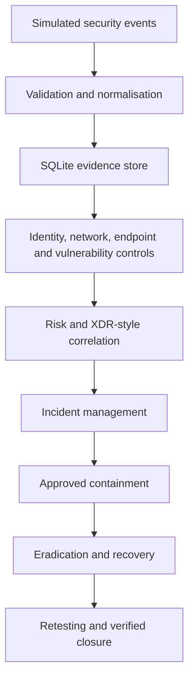
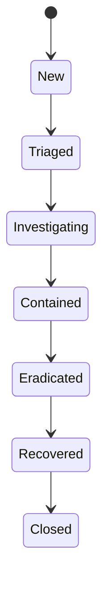

# NetShield Enterprise Upgrade

Phase 3A V2 extends the completed NetShield Phase 3 Automation project into a controlled enterprise-security simulation.

The project runs inside an Ubuntu VirtualBox sandbox using Python, SQLite and simulated security data. Microsoft Entra, Defender, Sentinel, Conditional Access and XDR are design references only. No production service, external target or real response action is used.

NetShield is my project. It was designed, built, configured, tested, validated, corrected, improved and documented as part of my engineering journey.

## Project boundary and controls

The upgrade keeps the original NetShield controls:

- default-deny access
- RBAC and automation ACL enforcement
- approval for disruptive actions
- local simulation only
- no real external targets
- evidence preservation
- SHA-256 integrity checks
- SQLite audit records
- duplicate-safe processing
- separation between detection, approval and execution
- no Microsoft platform dependency

## Architecture



The database remains the authoritative project record. Alerts, scores, incidents and response actions retain references to their original evidence.

---

## Enterprise foundation

### What it does

The foundation adds simulated enterprise users, devices, applications and services while reusing the original RBAC, ACL, logging and database controls.

### Why it exists

The upgrade needed a consistent enterprise context without replacing the security foundation that already worked.

### Main capabilities

- controlled enterprise identities and assets
- retention settings
- sensitive-field masking
- safe sandbox boundaries
- compatibility with the original Phase 3 project

### Testing notes

The first consistency check found `CYOD-002` missing from the CYOD inventory. The inventory was corrected before validation.

Stage 1 passed 12/12 checks.

### What I learned

An upgrade should extend trusted controls rather than create a second security model.

---

## Extended security data pipeline

### What it does

The pipeline accepts several JSONL security sources, validates their structure and stores accepted or rejected evidence.

### Why it exists

Later detections require consistent timestamps, source names, identifiers and preserved raw events.

### Workflow

`Read → Identify source → Validate → Normalise → Deduplicate → Store or quarantine`

### Observed output

- 12 valid events stored
- 2 malformed events quarantined
- complete compound source names preserved

### Testing notes

Repeated malformed input did not inflate quarantine evidence. Stage 2 passed 13/13 checks.

### Engineering observation

Compound source names were initially shortened. Source handling was corrected before final validation.

### What I learned

Reliable detection begins with reliable evidence handling.

---

## Asset and device identity

### What it does

Stage 3 compares device activity with the authoritative CYOD and asset context.

### Why it exists

A familiar MAC address or hostname is not enough to prove that a device is approved.

### Main rules

- device and asset identifiers remain primary
- MAC addresses remain supporting evidence
- unregistered and unknown devices remain different states
- database and web assets are not treated as devices

### Observed output

Three relevant events produced one High-severity alert for `CYOD-003`.

### Testing notes

Approved `CYOD-002` activity produced no false alert. Stage 3 passed 19/19 checks.

### What I learned

Device identity needs authoritative inventory context.

---

## Identity monitoring

### What it does

Identity monitoring evaluates authentication failures, password spraying, suspicious success, location, devices, MFA, privilege changes, dormant accounts and service-account activity.

### Why it exists

One event may look harmless, while several related events can show a meaningful identity pattern.

### Workflow

`Authentication evidence → Time-window grouping → Detection rules → Exceptions → Alert`

### Observed output

Twenty-four controlled events produced 16 alerts.

### Testing notes

A repeated run created no duplicates. One abnormal-access-time alert was reviewed as a False Positive with notes and audit evidence.

Stage 4 passed 12/12 checks and 19 focused tests.

### Engineering observation

Normal test sign-ins initially fell outside the configured baseline. Their times were corrected while one deliberate after-hours event remained.

### What I learned

Test data must agree with its baseline before results can be interpreted.

---

## Access-policy decisions

### What it does

The access engine evaluates identity, role, permission, device, application, location, network, MFA and risk context.

### Why it exists

Access decisions should explain why access was allowed, denied, challenged or restricted.

### Outcomes

- `allow`
- `deny`
- `challenge`
- `restrict`

Default outcome: `deny`

### Decision model

Configured policy priority is applied first. Equal-priority outcomes use:

`deny → restrict → challenge → allow`

### Observed output

Nine requests produced:

- 2 allow
- 4 deny
- 2 challenge
- 1 restrict

### Testing notes

A repeated run created no duplicate decisions. Stage 5 passed 14/14 checks and 13 focused tests.

### What I learned

A policy result must remain separate from any later response action.

---

## Network and Wi-Fi monitoring

### What it does

Network monitoring evaluates addresses, ports, services, connection volume, device identity, Wi-Fi security, access points and network zones.

### Why it exists

Network behaviour needs context from devices, locations, approved networks and policy.

### Main rules

- preserve every matching reason
- select one deterministic outcome
- treat MAC reuse as supporting evidence
- simulate all network restrictions

### Observed output

Thirty-four events produced 18 alerts and 34 access decisions.

### Testing notes

Repeated monitoring created no duplicate alerts, decisions or timeline records. Stage 6 passed 15/15 checks and 23 focused tests.

### Engineering observations

A rule-name error, unclear overlap handling and an incorrect response mapping were corrected.

### What I learned

Several rules can match one event, but the final outcome must remain clear.

---

## Endpoint monitoring

### What it does

Endpoint monitoring evaluates health, compliance, processes, commands, persistence indicators, hashes and crash patterns.

### Why it exists

Suspicious endpoint behaviour requires process and device context before response is considered.

### Main rules

- suspicious activity creates evidence, not automatic proof
- Critical alerts can create one consolidated device request
- approval changes only the simulated project record
- approved administrative and testing activity remains exempt

### Observed output

Twenty-six events produced 26 alerts across 13 detection types. One simulated isolation retained 10 supporting Critical alert keys.

### Testing notes

Stage 7 passed 14/14 checks and 17 focused tests.

### Engineering observation

Multiple isolation requests were initially created for one device. They were consolidated while preserving every supporting alert.

### What I learned

Detection, approval and isolation are separate events.

---

## Vulnerability and application-security findings

### What it does

Stage 8 creates evidence-backed findings linked to authoritative assets.

### Why it exists

Vulnerabilities need asset, exposure, exploitability and remediation context.

### Priority model

Priority uses severity, exploitability, asset criticality, exposure and confidence.

### Main rules

- preserve original risk evidence
- add remediation and verification history
- require authorised false-positive review
- do not convert a finding into an incident without related activity

### Observed output

Sixteen events produced seven findings:

- 1 Open
- 2 Planned
- 3 Verified
- 1 False Positive

### Testing notes

Stage 8 passed 16/16 checks and 14 focused tests.

### Engineering observations

The first remediation flow replaced original risk values. It was corrected so later verification added history without rewriting the finding.

### What I learned

Remediation changes current state, not historical evidence.

---

## Continuous monitoring and risk scoring

### What it does

Stage 9 performs scheduled health checks and calculates explainable risk for users, devices, assets and incidents.

### Why it exists

Security evidence changes over time and needs consistent reassessment.

### Scoring model

Risk uses:

- severity
- confidence
- asset criticality
- independent-source agreement
- validated exceptions
- time decay

### Main rules

- unknown criticality adds zero points
- repeated evidence from one source is not independent
- risk never replaces original evidence
- cooldown reduces repeated noise without deleting activity

### Observed output

The engine assessed 171 evidence mappings, scored 20 entities, created four High-risk alerts and reported seven healthy monitored components.

### Testing notes

A repeated cycle suppressed the same four alerts during cooldown. Stage 9 passed 20/20 checks and 15 focused tests.

### What I learned

Risk must remain explainable and honest about unknown context.

---

## XDR-style cross-source correlation

### What it does

Stage 10 correlates identity, access, network, endpoint, application and vulnerability evidence.

### Why it exists

Related activity across several sources can show a wider incident than any single alert.

### Correlation model

Strong identifiers such as device, asset, user, address, hostname, process and file hash are ordered anchors. MAC addresses, locations and detection names remain supporting context.

### Observed output

The corrected correlation produced:

- 10 candidate groups
- 3 incidents
- 65 evidence links
- 10 IoCs
- 3 MAC supporting observables

### Testing notes

Repeated correlation created no duplicate incidents, links or indicators. Stage 10 passed 20/20 checks and 17 focused tests.

### Engineering observation

Unrestricted transitive grouping initially merged unrelated device chains. Ordered anchors corrected the grouping while preserving explicit exploitation links.

### What I learned

Correlation must explain both why evidence was joined and why other evidence remained separate.

---

## Incident management

### What it does

Stage 11 converts correlated activity into managed incidents with ownership, lifecycle state, evidence, decisions, timelines, indicators, behaviours, ATT&CK references, vulnerability links and reports.

### Why it exists

Investigation needs a controlled history rather than disconnected alerts.

### Lifecycle



False-positive closure is allowed only from the early investigation states with permission.

### Observed output

Three managed incidents retained 65 evidence links, 10 IoCs, 31 behaviours, 12 ATT&CK references and six vulnerability links.

`INC-V2-11-0001` was assigned to `analyst01` and later reached verified closure.

### Testing notes

Each incident has JSON and readable reports. Hashes verify, repeated generation is duplicate-safe and reports match current incident state.

### Engineering observations

A vulnerability foreign key and overly strict lifecycle checks were corrected. Final review also found that one valid report still described an earlier incident state; report refresh and validation were corrected.

### What I learned

Integrity checks must confirm both unchanged content and current accuracy.

---

## Approval-controlled containment

### What it does

Stage 12 adds 10 simulated containment actions to the existing ACL.

### Why it exists

Disruptive response requires evidence, authorisation and least privilege.

### Main rules

- preserve evidence before action
- deny undefined actions
- require approval for disruptive actions
- block requester self-approval and self-execution
- record requested, approved, denied, successful and failed outcomes
- support rollback only when configured and safe

### Workflow

`Request → Preserve evidence → Approve or deny → Execute → Record result → Roll back when supported`

### Observed output

Four live records demonstrated automatic success, approved execution, denial, failure and safe rollback.

### Testing notes

Twenty focused tests passed. Stage 12 passed 21/21 checks. All evidence hashes verified and no real action occurred.

### What I learned

Approval is permission to continue; it is not proof of execution.

---

## Eradication, recovery and post-incident review

### What it does

Stage 13 adds 19 simulated actions covering accounts, devices, Wi-Fi, files, processes, persistence, SQL, vulnerabilities and restoration.

### Why it exists

Containment limits activity, but the incident still needs eradication, recovery and verification.

### Main capabilities

- separate request, approval and execution
- restore accounts and devices carefully
- increase post-recovery monitoring
- retest the original threat and vulnerability
- record lessons and improvements
- close only after verified recovery

### Lifecycle workflow

`Contained → Eradication actions → Eradicated → Recovery actions → Retests → Recovered → Review → Closed`

### Observed output

Eight live actions included four successful eradication actions, one denial, two successful restoration actions and increased monitoring.

Both original conditions were blocked during retesting.

### Testing notes

Twenty-two focused tests passed. Stage 13 passed 27/27 checks.

### Engineering observations

A self-approval denial flag was initially lost during transaction rollback. Denial handling was corrected so the audit event and database flag both remain stored.

### What I learned

Successful actions do not prove recovery. The original problem must no longer succeed.

---

## Full enterprise-concept validation

### What it does

Stage 14 validates the complete upgrade without changing the live evidence database.

### Why it exists

Individual components can pass while integration, cleanup or earlier-stage compatibility still fails.

### Validation workflow

`Check boundaries → Rebuild schema → Compile and import → Run tests → Run validators → Check evidence → Compare database hash → Clean up`

### Observed output

```text
Clean-state tables: 52
Clean-state named indexes: 211
Imported source modules: 38
Regression tests: 279
V2 validators: 13
Audit records checked: 176
Incident and recovery evidence records: 73
V2 STAGE 14 VALIDATION: PASS (56/56)
```

### Testing notes

Stage 14 passed 56/56 checks repeatedly. The live database hash remained unchanged.

### Engineering observation

The first cleanup assertion ran before the temporary-directory context had finished. It was moved after cleanup and passed on repeated validation.

### What I learned

Validation must not modify the evidence it is validating.

---

## Final revision and sign-off

### What it does

Stage 15 compares implementation, generated reports, documentation, thresholds, privacy checks, temporary files and Git changes before sign-off.

### Why it exists

A project is not complete only because its tests pass. Its evidence, reports and documentation must also describe the final state accurately.

### Final correction

The report for `INC-V2-11-0001` retained a valid hash but still showed Investigating after verified closure.

The generator was corrected to refresh reports after genuine lifecycle changes while remaining duplicate-safe. The Stage 11 validator now compares both report formats with current database records.

### Validation evidence

After correction:

- Stage 11 validation passed
- 279 regression tests passed twice
- Stage 13 passed 27/27 checks
- Stage 14 passed 56/56 checks
- SQLite integrity and foreign keys passed
- report hashes and current states matched
- no threshold change was justified
- no obsolete component was identified
- privacy and secret checks found no exposure
- generated Python caches were removed

### What I learned

A matching hash proves integrity, not current accuracy. Final validation needs both.

---

## Concept-to-implementation mapping

| Security concept | NetShield implementation |
|---|---|
| Zero Trust | Explicit identity, device, policy, MFA and risk checks |
| Least privilege | RBAC, ACL, approval and separation of duties |
| Assume breach | Cross-source monitoring, risk and incident correlation |
| XDR-style investigation | Correlated identity, network, endpoint, application and vulnerability evidence |
| Evidence integrity | Raw preservation, SHA-256 hashes and SQLite constraints |
| Continuous monitoring | Scheduled health checks, risk updates and alert cooldown |
| Incident response | Managed lifecycle, containment, eradication and recovery |
| Safe automation | Local simulation, default deny and no external targets |
| Verified recovery | Original-threat and vulnerability retesting |
| Auditability | Actor, target, evidence, decision and result records |
| Platform independence | Python and SQLite implementation with Microsoft concepts used only as references |

---

## Known limitations

- All users, devices, events and response actions are simulated.
- The project does not connect to production identity, endpoint, SIEM or cloud services.
- Response actions change project records rather than real systems.
- SQLite suits the controlled lab but is not a distributed enterprise data platform.
- Thresholds are based on documented lab evidence and require new evidence before tuning.
- The controlled datasets are smaller than real enterprise telemetry.
- Correlation depends on the identifiers and relationships available in the simulated evidence.
- Reports are generated files rather than an interactive case-management interface.
- Availability, performance and multi-user concurrency were not tested at production scale.
- Microsoft products are design references and are not implemented dependencies.

---

## System Validation

### Clean-state validation workflow

The final workflow rebuilds the tracked schema in a temporary database, checks Python syntax and imports, runs the full regression suite and all earlier validators, verifies integrated evidence and compares the live database hash before and after validation.

### Genuine results

- 279 regression tests passed.
- All 13 earlier V2 validators passed.
- Stage 14 passed 56/56 checks repeatedly.
- 52 tables and 211 named indexes rebuilt successfully.
- 38 source modules imported.
- 176 audit records were checked.
- 73 incident and recovery evidence records remained available.
- SQLite integrity and foreign keys passed.
- The live database hash remained unchanged.
- No Microsoft platform SDK dependency was found.
- **151 tests passed with zero unclosed-database warnings.**

### Problems discovered

Final validation found:

- a cleanup assertion running before temporary cleanup
- an earlier validator assuming the incident would remain Investigating
- a self-approval flag lost during transaction rollback
- incident reports retaining a valid but outdated lifecycle state

### How they were fixed

- cleanup verification was moved after the temporary context
- lifecycle validation accepted later evidence-backed states
- denial handling preserved the self-approval flag
- report generation refreshed authorised state changes
- report validation compared generated content with current incident records

### Engineering observations

No evidence supported changing the established thresholds. Earlier components remained necessary for compatibility testing. Privacy review found no tracked credential or personal-data exposure, and temporary Python cache files were removed.

### What I learned

Final review must check accuracy, integrity, permissions, repeatability and documentation together. Passing tests alone are not enough.

### Next expansion

Phase 3A V2 provides the foundation for later NetShield cloud, cloud-security and security-automation work.

After sign-off, changes should be limited to genuine defects, security improvements or justified engineering requirements.
